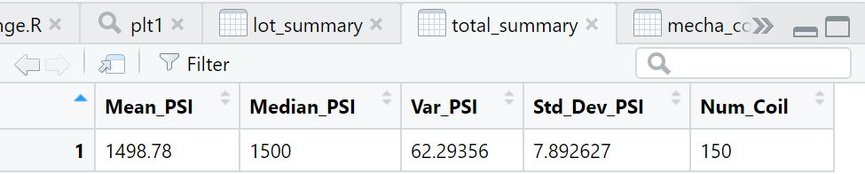

# MechaCar_Statistical_Analysis

## Deliverable 1: Linear Regression to Predict MPG

The `MechaCar_mpg.csv` dataset contains mpg test results for 50 model MechaCars. The MechaCar models were created utilizing various plan details to recognize ideal vehicle execution. Numerous measurements, like vehicle length, vehicle weight, spoiler point, drivetrain, and ground freedom, were gathered for every vehicle. Utilizing your insight into R, you'll plan a direct model that predicts the mpg of MechaCar models utilizing a few factors from the `MechaCar_mpg.csv` document.

- The `MechaCar_mpg.csv` file is imported and read into a data frame
- An RScript is written for a linear regression model to be performed on all six variables
- An RScript is written to create the statistical summary of the linear regression model with the intended p-values
- There is a summary that addresses all three questions

The **vehicle length**, and **vehicle ground clearance** are genuinely liable to give non-arbitrary measures of change to the model. In other words, the vehicle length and vehicle ground freedom altogether affect miles per gallon on the MechaCar model. On the other hand, the **vehicle weight**, **spoiler angle**, and **All Wheel Drive (AWD)** have p-values that show an irregular measure of change with the dataset. 

The p-value for this model, p-value: 5.35e-11, is a lot more modest than the accepted importance level of 0.05%. This demonstrates there is adequate proof to **dismiss our null hypothesis**, which further indicates that the incline of this **direct model isn't zero**. 

This straight model has a r-squared worth of 0.7149, which implies that around 71% of all mpg forecasts will be dictated by this model. Generally speaking, his numerous relapse model predicts **mpg of MechaCar models adequately**. 

On the off chance that we eliminate the less significant free factors (vehicle weight, spoiler point, and All all-wheel drive), the consistency diminishes, however not radically: the r-squared worth tumbles from 0.7149 to 0.674.

## Deliverable 2: Create Visualizations for the Trip

## Deliverable 3: T-Tests on Suspension Coils

## Deliverable 4: Design a Study Comparing the MechaCar to the Competition

This review would include gathering information on MechaCar and its equivalent models across a few unique producers throughout the most recent 3 years. 

- What are the contests' practically identical models?
- Which vehicles will MechaCar rival no holds barred? which vehicles will be remembered for the review? 
- Which elements will check out the review to decide the applicable selling cost?

### Metric

Collecting data for comparable models across all major manufacturers for the past 3 years for the following metrics:

- Safety Feature Rating: **Independent Variable**
- Current Price (Selling): **Dependent Variable**
- Drive Package: **Independent Variable**
- Engine (Electric, Hybrid, Gasoline / Conventional): **Independent Variable**
- Resale Value: **Independent Variable**
- Average Annual Cost of Ownership (Maintenance): **Independent Variable**
- MPG (Gasoline Efficiency): **Independent Variable**

### Hypothesis: Null and Alternative

After determining which factors are key for the MechaCar's genre:

- **Null Hypothesis (Ho)**: MechaCar is priced correctly based on its performance of key factors for its genre.
- **Alternative Hypothesis (Ha)**: MechaCar is NOT priced correctly based on the performance of key factors for its genre.

### Statistical Tests

A **multiple linear regression** would be utilized to decide the elements that have the most elevated connection/consistency with the rundown selling value (subordinate variable); which blend greatly affects value.
